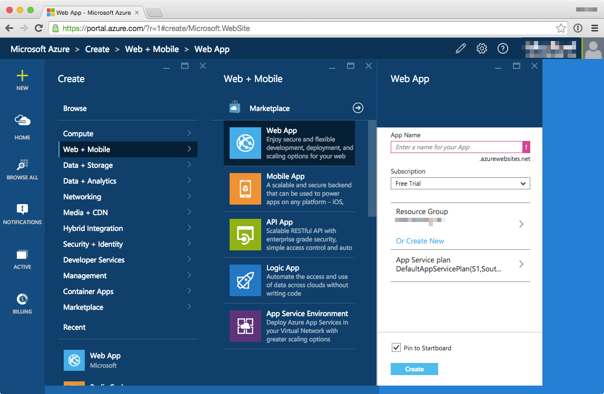
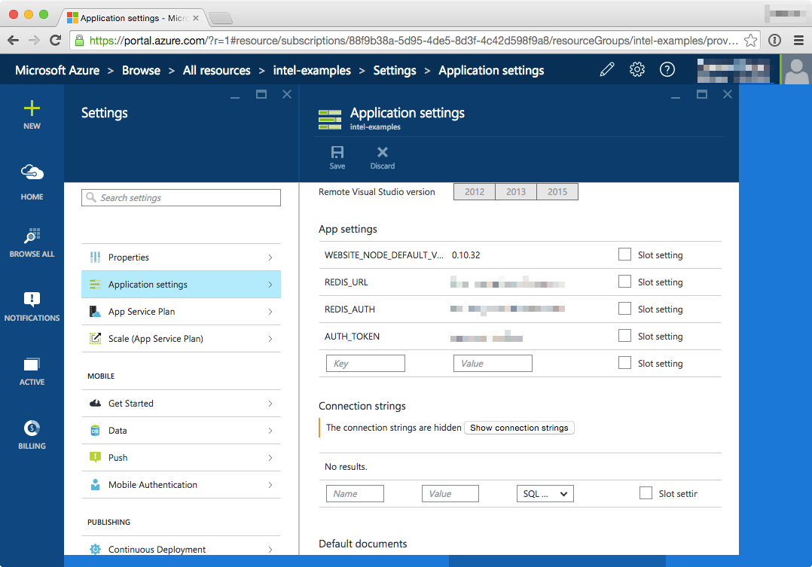

# intel-iot-examples-datastore

The Intel-IoT-Examples-Datastore is a small Redis-backed webserver data storage app, powered by [Express][].

It is intended to provide a simple data store for example appplications that are part of the Intel IoT Starter Kits examples. Although this data storage app was initially developed to deploy on Microsoft Azure, since it is based on commonly used open source modules, it should be easy to deploy on many different cloud hosts.

[Express]: https://github.com/strongloop/express

### Setup

To install the app's dependencies, use NPM:

    $ npm install

You'll also need to have Redis installed.
For more info on that, see the [Redis download page](http://redis.io/download).

### Configuration

The primary configuration for the application takes the form of the following ENV vars:

- **REDIS_URL** - the URL to use for Redis communication
- **REDIS_AUTH** - authentication token for Redis backend
- **PORT** - port to serve app on (defaults to `3000`)
- **AUTH_TOKEN** - authentication token for clients to use

### Deployment

This guide will cover setting up a deployment environment for the Datastore on Microsoft Azure.

For other platforms, please refer to the platform documentation.

Before we begin, please ensure you have an [Azure account](https://portal.azure.com/signin/index).

As with the "Setup" section, our application's backing dependency is a running Redis instance.

For more information on setting up a Redis Cache on Azure, please see [Microsoft's site](https://azure.microsoft.com/en-us/documentation/articles/cache-dotnet-how-to-use-azure-redis-cache/).

In the Azure Portal, first create a new Web App:

Then, once it's created, access it's Settings page and provide "App Settings" key/value combinations, per the environment variables discussed above.

You don't need to set `PORT`, as Azure will do that for you.

You can also obtain the `REDIS_URL` and `REDIS_AUTH` settings from the Redis Cache you created earlier.

### Routes

The Express app exposes two sets of routes, both using basic token authentication.

To authorize, provide the AUTH_TOKEN you set in the `X-Auth-Token` HTTP header.

#### Counter

The counter routes are used to increment an increasing counter.

- **GET /counter/:key** - gets the current value of a counter
- **GET /counter/:key/inc** - increments a counter by 1

#### Logger

The logger routes wrap redis lists, and are used to keep a linear backlog of values.

- **GET /logger/:key** - gets the latest value of a log
- **PUT /logger/:key** - adds a value to a log (`value` param in POST body)
- **GET /logger/:key/all** - returns all values of a log

let me add some random stuff here